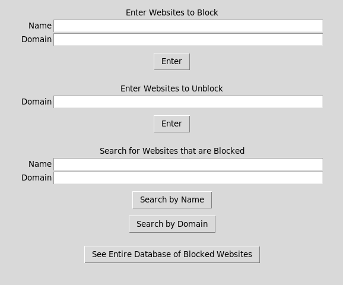
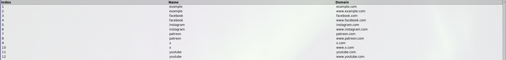

# Website Blocker (Windows/macOS/Linux)

A simple cross-platform GUI application that lets you block and unblock websites by editing the system hosts file. Blocked sites are stored in a searchable SQLite database and managed through a Tkinter interface.

---

## Features 

- **GUI with Tkinter** – Add, remove, search, and view blocked websites.
- **Cross-platform support** – Works on Windows, macOS, and Linux.
- **Privilege elevation** – Automatically requests admin/root access to modify the hosts file:
  - Windows: UAC
  - macOS: AppleScript prompt
  - Linux: `pkexec` or fallback to `sudo`
- **SQLite integration** – Keeps a persistent database (`websites_blocked.db`) of blocked domains.
- **Input validation** – Regex checks for valid domains and duplicate prevention.

---

## 📂 Project Structure
- `Website_Blocker.py` — Main program
- `websites_blocked.db` — SQLite DB (created at runtime; ignored in repo)
- `README.md` — Project overview
- `requirements.txt` — Dependencies/notes
- `LICENSE` — MIT License
- `assets/` — screenshots

---

## 🚀 Installation
### Requirements
- Python 3.9+
- Tkinter (included with most Python distributions)
- SQLite3 (bundled with Python)

> On Linux, you may need to install Tkinter manually:
```bash
sudo apt install python3-tk
```

---

## Screenshots




